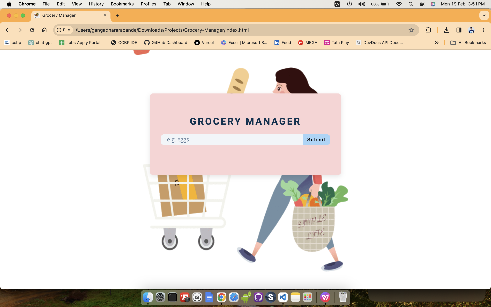

### Grocery Manager

      

 

  

Welcome to the Grocery Manager web application! This simple yet effective tool allows users to manage their grocery list with ease. The application is built using HTML, CSS, and JavaScript, providing a responsive and intuitive user interface.

## Features

- **Add:** Add new grocery items to your list.
- **Edit:** Modify existing items on your list.
- **Delete:** Remove items you no longer need.
- **Clear:** Clear the items in the list.

## Project Structure
index.html: The main HTML file containing the structure of the web page.
style.css: The stylesheet file for styling the application.
script.js: The JavaScript file handling the dynamic functionality of the Grocery Manager.

 

  

 

output:

      
      
      
      
      

 

<h1 align=center>Happy Coding 👨‍💻</h1>

Show some ❤️&nbsp; by giving the star to this repo

<a href="https://github.com/gangadhararaoande/grocery-manager.git">Back to top</a>

